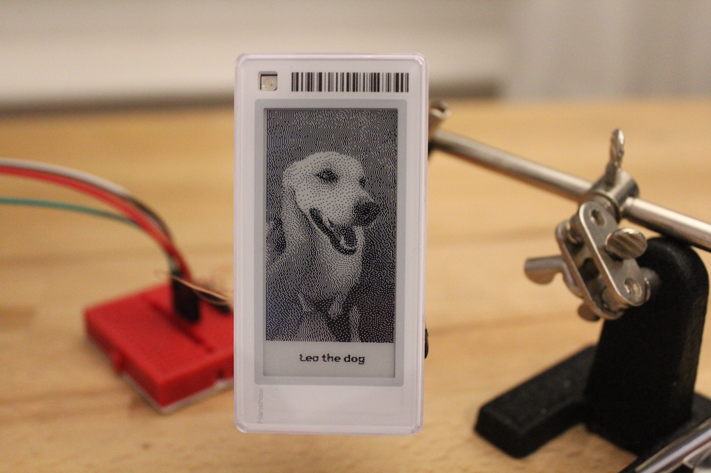

This repository contains Python code for talking to the [ATC_TLSR_Paper](https://github.com/atc1441/ATC_TLSR_Paper) open-source firmware for the Hanshow e-paper pricetag.

# Installation
```bash
# Clone the repository.
$ git clone git@github.com:rbaron/pricetag-printer.git
$ cd pricetag-printer
# Create a virtualenv on venv/ and activate it.
$ virtualenv --python=python3 venv
$ source venv/bin/activate
# Install requirements from requirements.txt.
$ pip install -r requirements.txt
```

# Usage
```bash
$ python print.py --help
usage: print.py [-h] [--devicename] [--log-level {debug,info,warn,error}] [--img-binarization-algo {mean-threshold,floyd-steinberg}] [--show-preview] filename

sends an image to the EPD BLE service running in the ATC_TLSR_Paper Hanshow open source firmware.

positional arguments:
  filename

optional arguments:
  -h, --help            show this help message and exit
  --devicename          Specify the Bluetooth device name to search for. Default value is GT01.
  --log-level {debug,info,warn,error}
  --img-binarization-algo {mean-threshold,floyd-steinberg}
                        Which image binarization algorithm to use.
  --show-preview        If set, displays the final image and asks the user for confirmation before printing.
```

# Example
```bash
% python print.py --show-preview test.png
⏳ Applying Floyd-Steinberg dithering to image...
✅ Done.
ℹ️ Displaying preview.
🤔 Go ahead with print? [Y/n]?
✅ Read image: (42, 384) (h, w) pixels
✅ Generated BLE commands: 2353 bytes
⏳ Looking for a BLE device named GT01...
✅ Got it. Address: 09480C21-65B5-477B-B475-C797CD0D6B1C: GT01
⏳ Connecting to 09480C21-65B5-477B-B475-C797CD0D6B1C: GT01...
✅ Connected: True; MTU: 104
⏳ Sending 2353 bytes of data in chunks of 101 bytes...
✅ Done.
```