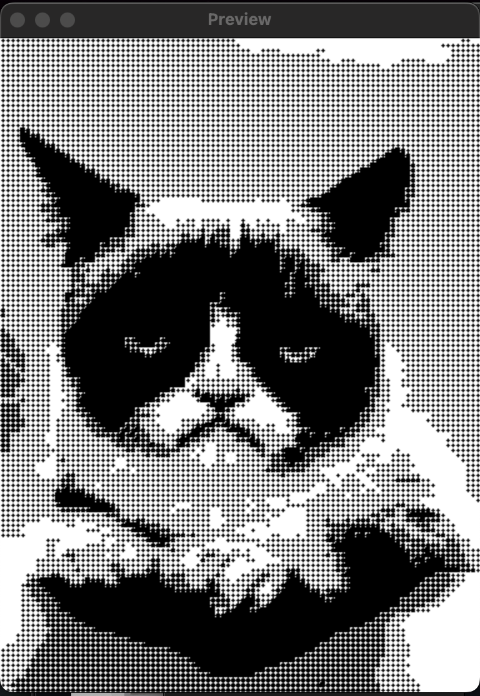
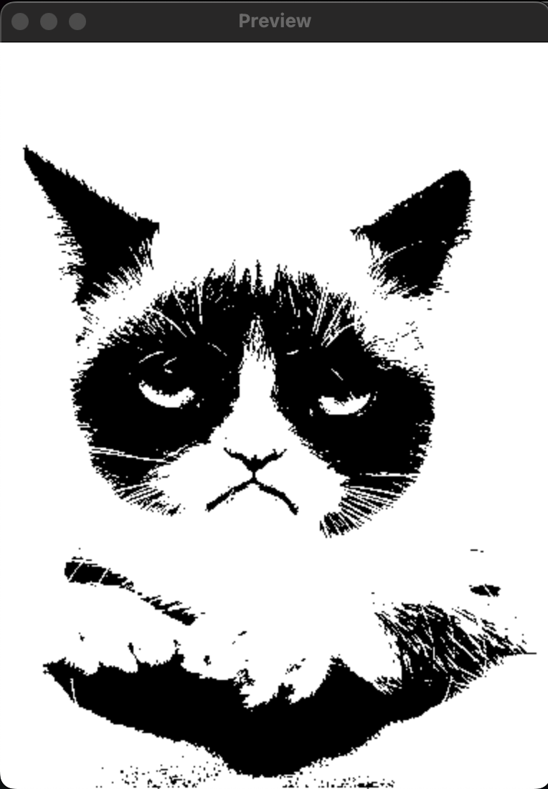

Cat printer is a portable thermal printer sold on AliExpress for around $20.

This repository contains Python code for talking to the cat printer over Bluetooth Low Energy (BLE). The code has been reverse engineered from the [official Android app](https://play.google.com/store/apps/details?id=com.frogtosea.iprint&hl=en_US&gl=US).

# Installation
```bash
# Clone the repository.
$ git clone git@github.com:rbaron/catprinter.git
$ cd catprinter
# Create a virtualenv on venv/ and activate it.
$ virtualenv --python=python3 venv
$ source venv/bin/activate
# Install requirements from requirements.txt.
$ pip install -r requirements.txt
```

# Usage
```bash
$ ./print.py --help
usage: print.py [-h] [-l {debug,info,warn,error}] [-b {mean-threshold,floyd-steinberg,atkinson,halftone,none}] [-s] [-d DEVICE] [-e ENERGY]
                filename

prints an image on your cat thermal printer

positional arguments:
  filename

options:
  -h, --help            show this help message and exit
  -l {debug,info,warn,error}, --log-level {debug,info,warn,error}
  -b {mean-threshold,floyd-steinberg,atkinson,halftone,none}, --img-binarization-algo {mean-threshold,floyd-steinberg,atkinson,halftone,none}
                        Which image binarization algorithm to use. If 'none' is used, no binarization will be used. In this case the image has to
                        have a width of 384 px.
  -s, --show-preview    If set, displays the final image and asks the user for confirmation before printing.
  -d DEVICE, --device DEVICE
                        The printer's Bluetooth Low Energy (BLE) address (MAC address on Linux; UUID on macOS) or advertisement name (e.g.:
                        "GT01", "GB02", "GB03"). If omitted, the the script will try to auto discover the printer based on its advertised BLE
                        services.
  -e ENERGY, --energy ENERGY
                        Thermal energy. Between 0x0000 (light) and 0xffff (darker, default).
```

# Example
```bash
% ./print.py --show-preview test.png
⏳ Applying Floyd-Steinberg dithering to image...
✅ Done.
ℹ️ Displaying preview.
🤔 Go ahead with print? [Y/n]?
✅ Read image: (42, 384) (h, w) pixels
✅ Generated BLE commands: 2353 bytes
⏳ Looking for a BLE device named GT01...
✅ Got it. Address: 09480C21-65B5-477B-B475-C797CD0D6B1C: GT01
⏳ Connecting to 09480C21-65B5-477B-B475-C797CD0D6B1C: GT01...
✅ Connected: True; MTU: 104
⏳ Sending 2353 bytes of data in chunks of 101 bytes...
✅ Done.
```


# Different Algorithms

**Mean Threshold:**


**Floyd Steinberg (default):**


**Atkinson:**


**Halftone dithering:**



**None (image must be 384px wide):**


